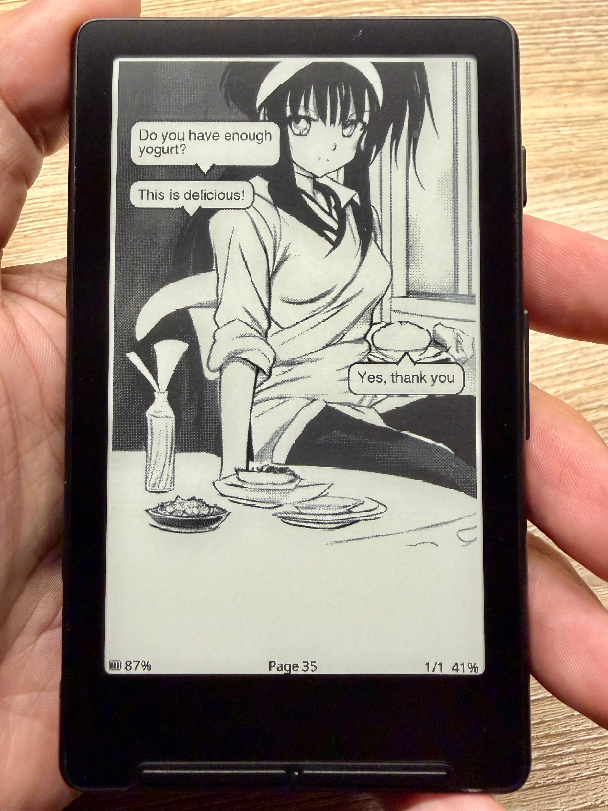

<p align="center">
  
</p>

# epub-to-manga

Convert EPUB novels into manga-style EPUBs using a local LLM for scene parsing and Stable Diffusion for image generation.

## How it works

1. Reads your EPUB and splits the text into scenes
2. Uses an Ollama LLM to parse each scene — extracting characters, dialogue, mood, and setting
3. Generates a manga-style illustration for each page via Stable Diffusion
4. Adds speech bubbles with character dialogue
5. Packages everything into a new EPUB

## Requirements

- Python 3.10+
- [Ollama](https://ollama.com) running locally
- One of the following Stable Diffusion backends:
  - [AUTOMATIC1111 stable-diffusion-webui](https://github.com/AUTOMATIC1111/stable-diffusion-webui)
  - [ComfyUI](https://github.com/comfyanonymous/ComfyUI) *(recommended for Apple Silicon)*
  - [InvokeAI](https://github.com/invoke-ai/InvokeAI)

## Installation

```bash
pip install -r requirements.txt
```

Pull an Ollama model:

```bash
ollama pull llama3
```

## Usage

```bash
python3 main.py book.epub
python3 main.py book.epub output.epub
python3 main.py book.epub --layout tiny --model mistral
python3 main.py book.epub --sd-url http://192.168.1.10:7860 --steps 30 --size 512x768
python3 main.py book.epub --dry-run
```

If no Stable Diffusion backend is running, the tool will detect any local installations and offer to launch or install one for you.

## Options

| Flag | Default | Description |
|---|---|---|
| `--layout` | `normal` | `normal` = 3 scenes/page, `tiny` = 1 scene/page |
| `--model` | `llama3` | Ollama model for scene parsing |
| `--ollama-url` | `http://localhost:11434` | Ollama API URL |
| `--sd-url` | `http://127.0.0.1:7860` | Stable Diffusion API URL |
| `--sd-path` | — | Path to SD install; auto-starts if not running |
| `--steps` | `20` | Diffusion steps per image (higher = better quality) |
| `--style` | `lineart` | `lineart` = clean outlines, `manga` = screentone shading |
| `--size` | `768x1024` | Output image dimensions |
| `--workers` | `2` | Parallel image generation workers |
| `--hint` | — | Character description, e.g. `--hint "Rocky:alien who resembles a rock spider"` |
| `--jpeg-quality` | `85` | EPUB image quality (1–95, lower = smaller file) |
| `--dry-run [N]` | — | Preview first N prompts without generating images |
| `--verbose` / `-v` | — | Enable debug logging |

## Configuration

Default URLs and model can be changed in `config.py`:

```python
OLLAMA_URL = "http://localhost:11434/api/generate"
OLLAMA_MODEL = "llama3"
SD_API_URL = "http://127.0.0.1:7860/sdapi/v1/txt2img"
```

The tool saves its SD backend path to `~/.epub-to-manga` so you don't need `--sd-path` on subsequent runs.

## Resuming

Scene parsing and image generation both support resuming. Parsed scenes are cached to `manga-<bookname>.cache.json`, and generated page images are saved to `<output>_pages/`. Re-running the same command will pick up where it left off.

## Project structure

```
epub-to-manga/
├── main.py                  # Entry point
├── config.py                # Default URLs and model
├── requirements.txt
├── core/
│   ├── epub_reader.py       # EPUB text extraction
│   └── scene_splitter.py    # Text → scenes
├── ai/
│   ├── llm_client.py        # Ollama API client
│   ├── scene_parser.py      # Scene → structured JSON
│   └── character_memory.py  # Character tracking across scenes
├── manga/
│   ├── prompt_builder.py    # SD prompt construction
│   ├── panel_layout.py      # Scene grouping into pages
│   └── speech_bubbles.py    # Dialogue overlay rendering
├── image/
│   ├── backend.py           # Backend router (A1111 / ComfyUI)
│   ├── a1111_api.py         # AUTOMATIC1111 API
│   ├── comfy_api.py         # ComfyUI API + workflow builder
│   ├── sd_launcher.py       # SD auto-start and install
│   └── device.py            # Device detection
├── export/
│   └── epub_builder.py      # Output EPUB assembly
└── utils/
    └── naming.py            # Output filename helpers
```
